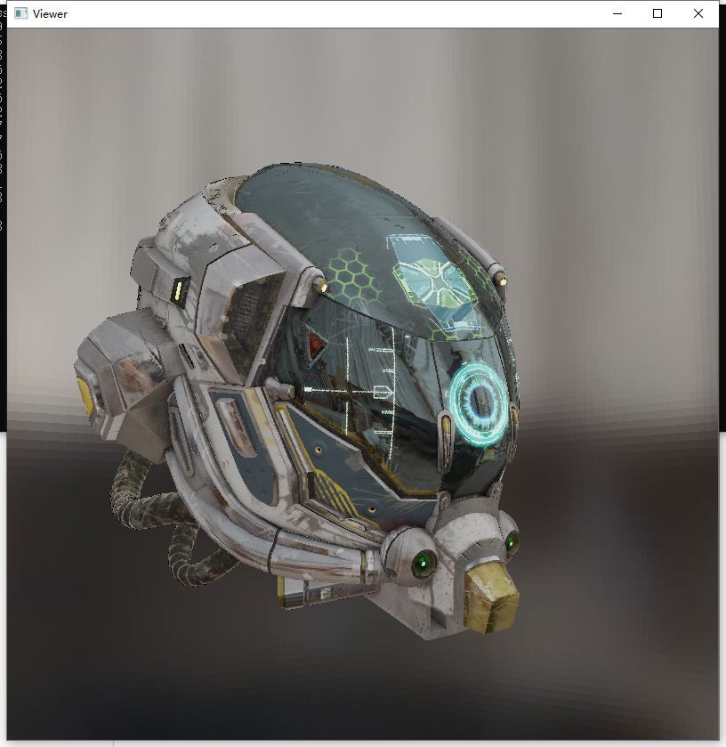
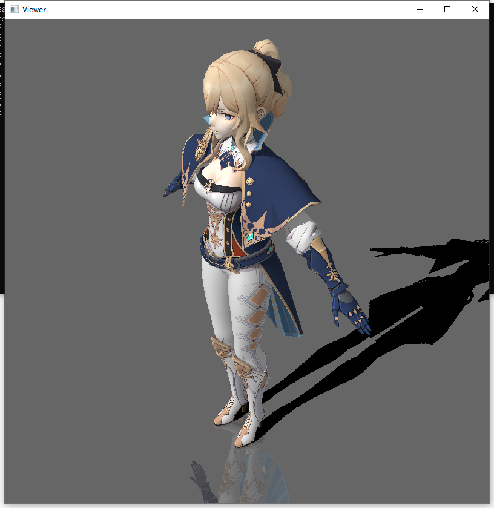

# MiniRenderer
软渲染器

# Intro
  找工作用demo，纯cpu下的软渲染器，目前就两个场景  
  - 1、琴：blinn-phong光照 平面反射 shadowmap  
  - 2、helmet：IBL的PBR光照  
  
# Catalog
  - Assetes:相关模型  
    - common:helmet场景下IBL相关贴图，包括prefilter environment map、irradiance map以及brdf-lut  
    - helmet:helmet模型  
    - qin:琴模型  
    - workshop:helmet场景下skybox  
    - preview：结果截图  
  - Dependencies:GLFW库文件用作显示窗口  
  - Src:源代码文件  
    - core:渲染相关代码，渲染管线相关核心逻辑在Render类中，场景的渲染pass定义在Scence.cpp中。其他包括向量运算，模型、相机等  
    - shader：基于虚函数实现的shader，包括了基类Shader以及派生的PBR,Phong以及Skybox、shadow、reflection等  
    - main.cpp:程序入口  

# Preview

